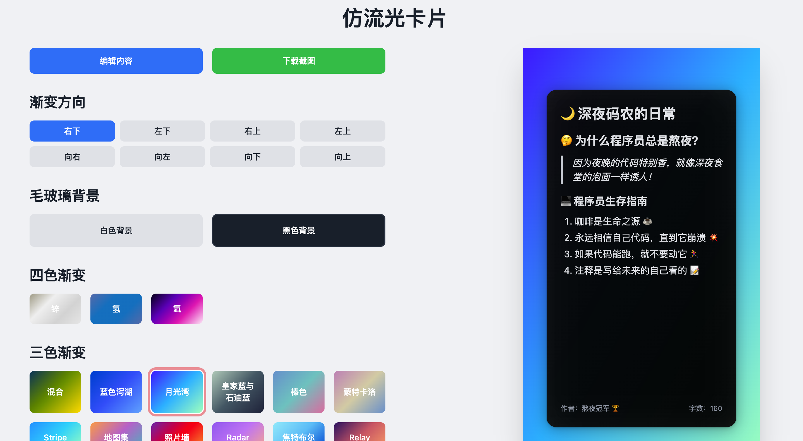

# 仿流光卡片



一个优雅的渐变流光效果展示工具，支持自定义渐变方向、毛玻璃效果和内容编辑。

## ✨ 功能特点

- 🎨 丰富的渐变流光效果
  - 支持双色、三色、四色渐变
  - 预设多种精美流光配色方案
- 🔄 灵活的渐变方向控制
  - 支持8种渐变方向
  - 实时预览流光效果
- 🖼️ 毛玻璃效果
  - 支持黑白两种背景
  - 优雅的阴影效果
- 📝 内容编辑
  - 支持 Markdown 格式
  - 实时预览
  - 支持代码块、列表、引用等格式
- 📱 移动端预览
  - 模拟手机界面
  - 支持截图下载

## 🚀 快速开始

1. 克隆项目
```bash
git clone [项目地址]
cd [项目目录]
```

2. 安装依赖
```bash
npm install
```

3. 启动开发服务器
```bash
npm run dev
```

4. 构建生产版本
```bash
npm run build
npm run start
```

## 🛠️ 技术栈

- Next.js - React 框架
- TypeScript - 类型安全的 JavaScript
- Tailwind CSS - 原子化 CSS 框架
- React Markdown - Markdown 渲染
- html-to-image - 截图功能

## 📝 使用说明

1. 选择渐变颜色
   - 点击颜色卡片选择预设渐变
   - 支持双色、三色、四色渐变

2. 调整渐变方向
   - 使用方向按钮调整渐变角度
   - 支持8种不同方向

3. 设置毛玻璃效果
   - 选择白色或黑色背景
   - 调整透明度

4. 编辑内容
   - 点击编辑按钮打开编辑框
   - 支持 Markdown 语法
   - 实时预览效果

5. 下载截图
   - 点击下载按钮保存当前效果
   - 支持高清截图

## 📦 项目结构

```
├── app/
│   ├── components/     # 组件目录
│   ├── page.tsx        # 主页面
│   └── layout.tsx      # 布局文件
├── public/             # 静态资源
│   └── markdown.md     # 默认内容
├── color_zh.json       # 颜色配置
└── package.json        # 项目配置
```

## 🤝 贡献指南

1. Fork 项目
2. 创建特性分支 (`git checkout -b feature/AmazingFeature`)
3. 提交更改 (`git commit -m 'Add some AmazingFeature'`)
4. 推送到分支 (`git push origin feature/AmazingFeature`)
5. 创建 Pull Request

## 📄 许可证

MIT License

## 👏 致谢

感谢所有为这个项目做出贡献的人！ 